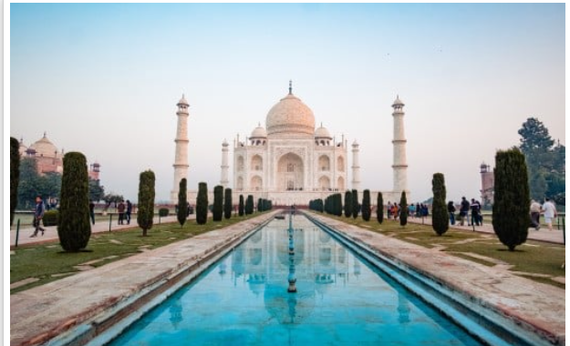
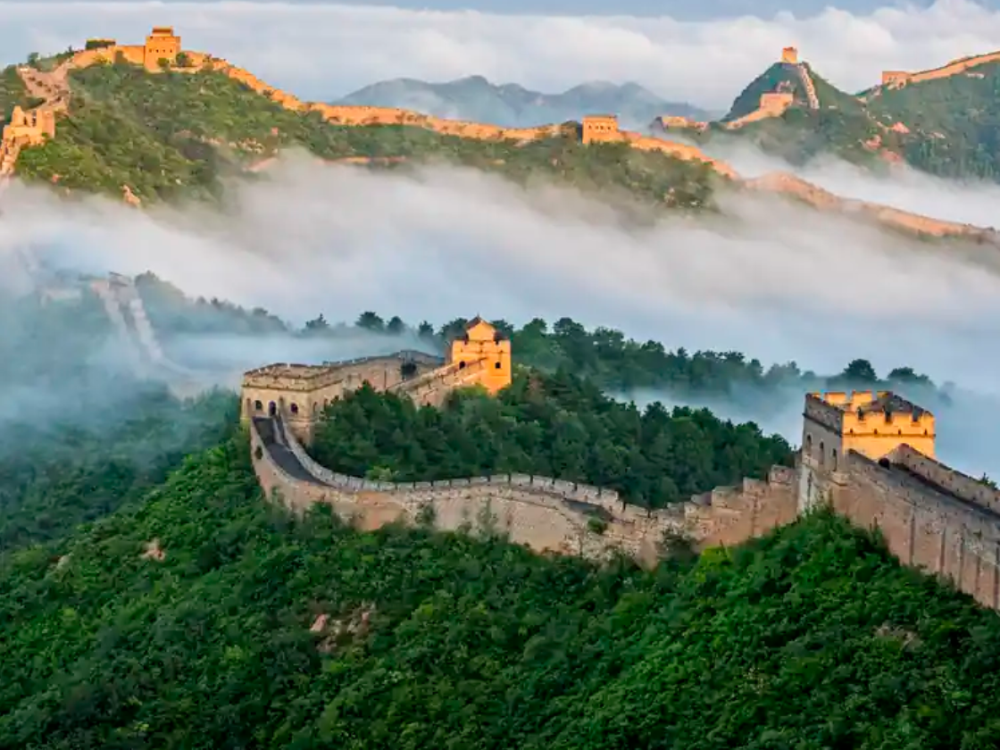
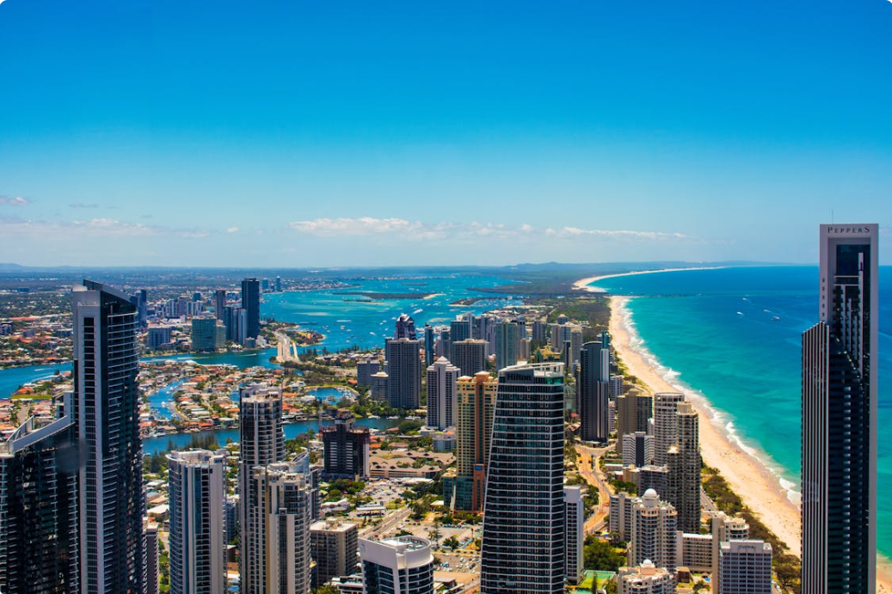

# Ex04 Places Around Me
## Date: 24.09.25

## AIM
To develop a website to display details about the places around my house.

## DESIGN STEPS

### STEP 1
Create a Django admin interface.

### STEP 2
Download your city map from Google.

### STEP 3
Using ```<map>``` tag name the map.

### STEP 4
Create clickable regions in the image using ```<area>``` tag.

### STEP 5
Write HTML programs for all the regions identified.

### STEP 6
Execute the programs and publish them.

## CODE
```
home.html
<!DOCTYPE html>
<html lang="en">
<head>
   
    <title>WORLD MAP</title>
</head>
<body>
    <!-- Image Map Generated by http://www.image-map.net/ -->


<map name="image-map">
    <area target="" alt="INDIA" title="INDIA" href="india.html" coords="79,233,138,195" shape="rect">
    <area target="" alt="CHINA" title="CHINA" href="china.html" coords="144,92,341,164" shape="rect">
    <area target="" alt="AUSTRALIA" title="AUSTRALIA" href="australia.html" coords="461,524,557,619" shape="rect">
</map>
</body>
</html>

india.html

<!DOCTYPE html>
<html lang="en">
<head>
    <meta charset="UTF-8">
    <meta name="viewport" content="width=device-width, initial-scale=1.0">
    <title>INDIA</title>
</head>
<body>
   
   
    India is one of the most diverse and fascinating countries in the world 🌍. Here are some key points about it:

Geography: India is the 7th largest country by land area, located in South Asia. It’s bounded by the Himalayas in the north and surrounded by the Indian Ocean, Arabian Sea, and Bay of Bengal.

Population: It is the most populous country in the world (over 1.4 billion people), with incredible cultural and linguistic diversity.

Languages: There are 22 official languages (including Hindi, Tamil, Bengali, Telugu, Kannada, Malayalam, Urdu, and others) and hundreds of dialects spoken across the country. English is also widely used.

Culture: India is known for its traditions, spirituality, music, dance forms (like Bharatanatyam, Kathak), and festivals (Diwali, Holi, Eid, Christmas, Pongal, Onam, etc.).

Food: Indian cuisine is globally loved—spicy curries, biryani, samosas, masala dosa, chai, and sweets like gulab jamun and jalebi. Each region has its own unique dishes.

History: India has one of the world’s oldest civilizations—the Indus Valley Civilization. It has given rise to major religions like Hinduism, Buddhism, Jainism, and Sikhism. It was ruled by Mauryas, Guptas, Mughals, and then the British until independence in 1947.

Economy: Currently, India is the fifth-largest economy in the world and a fast-growing hub for technology, space research (ISRO), and startups.


</body>
</html>

china.html
<!DOCTYPE html>
<html lang="en">
<head>
    <meta charset="UTF-8">
    <meta name="viewport" content="width=device-width, initial-scale=1.0">
    <title>CHINA</title>
</head>
<body>
   
    China is one of the world’s most ancient civilizations and today a global superpower. Here are some key highlights:

Geography: China is the 4th largest country by area (after Russia, Canada, and the U.S.). It shares borders with 14 countries and has diverse landscapes—deserts (Gobi, Taklamakan), plateaus (Tibet), mountains (Himalayas), and fertile river basins (Yangtze, Yellow River).

Population: With over 1.4 billion people, China is the second most populous country (after India).

History:

China has one of the world’s oldest continuous civilizations (over 4,000 years).

Ancient dynasties like Xia, Shang, Zhou, Qin, Han, Tang, Ming, and Qing shaped Chinese culture.

The Great Wall of China was built to protect against invasions.

China invented paper, gunpowder, compass, and printing—known as the Four Great Inventions.

Language: The official language is Mandarin Chinese, but there are many dialects (Cantonese, Shanghainese, Hokkien, etc.). Chinese writing uses characters (logograms) instead of alphabets.

Culture:
</body>
</html>

australia.html
<!DOCTYPE html>
<html lang="en">
<head>
    <meta charset="UTF-8">
    <meta name="viewport" content="width=device-width, initial-scale=1.0">
    <title>AUSTRALIA</title>
</head>
<body>
    
    Here’s an overview of Australia:

Geography:

Australia is both a country and a continent.

It’s the 6th largest country in the world by area, but much of it is desert or semi-arid, called the Outback.

Surrounded by the Indian and Pacific Oceans, it has beautiful coastlines, coral reefs, and unique landscapes.

Population:

Around 26 million people live in Australia (much less compared to India or China).

Most people live in coastal cities like Sydney, Melbourne, Brisbane, Perth, and Adelaide.

History:

Indigenous peoples called Aboriginal Australians and Torres Strait Islanders have lived there for over 65,000 years—one of the world’s oldest continuous cultures.

Europeans arrived in the 1600s, and Britain colonized it in the late 1700s.

Australia became an independent nation in 1901, though it still recognizes the British monarch as Head of State.
</body>
</html>
```

## OUTPUT









## RESULT
The program for implementing image maps using HTML is executed successfully.
